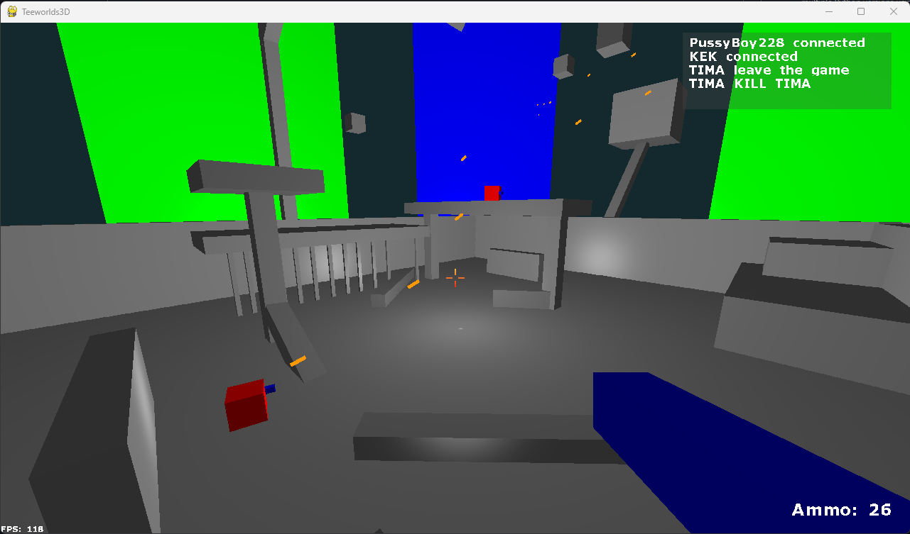
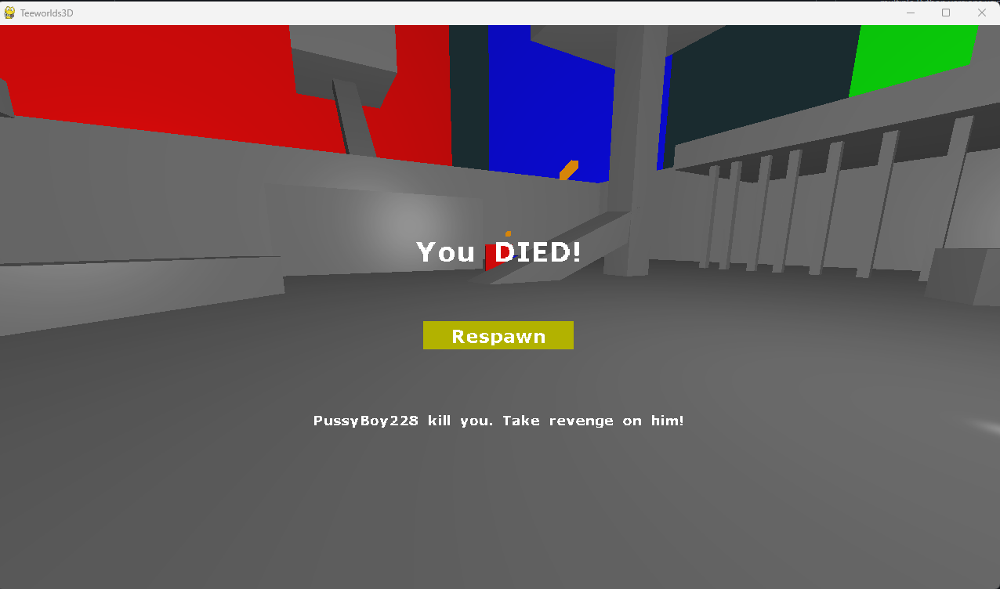
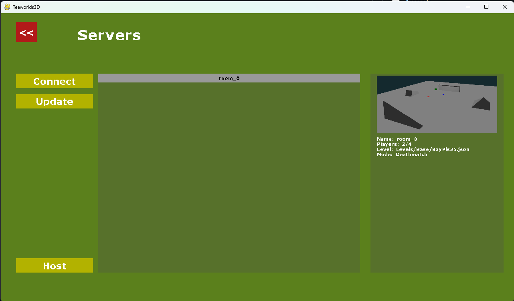
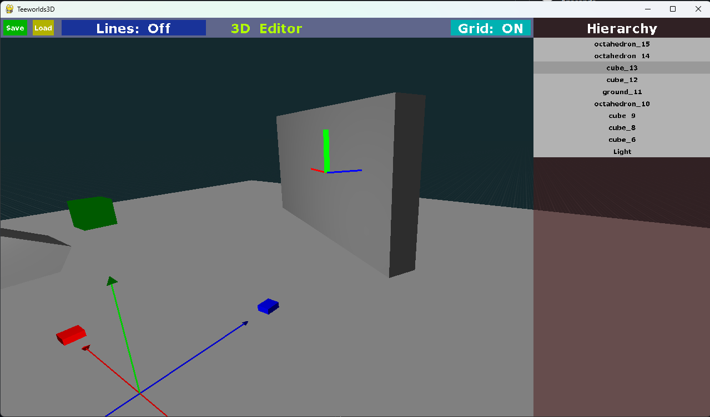

# Teeworlds3D

**Описание:** Teeworlds но в 3D на кастомном движке!

## Использование

**Версия Python 3.12!**

Сначала нужно установить все модули из `requirements.txt`

```
pip install -r requirements.txt
```

Затем запускаем приложение

```
python .\Scripts\Source\General\Game\teeworlds.py
```

Для игры по сети потрубется запустить и сервер

```
python .\Scripts\Source\Multiplayer\server.py
```

## Скриншоты






## Управление

### Перемещение

- **W, A, S, D** — перемещение
- **SPACE** — прыжок
- **LMB** — Стрельба
- **R** — Перезарядка
- **P** — Читы
- **RMB** — Хук
